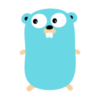
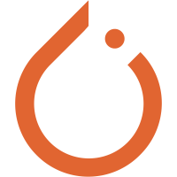

</a>

**
📢你知道什么时候会赢吗？就是往前奔跑。黑夜中你知道什么时候会天亮吗？跑着跑着就天亮了🏃
**

### 👋 关于我 | Player

- 🌏️ 帝都末流211&&985混血计算机学生
- 🥉 XCPC铜牌练习生 🔜🧙计算机视觉炼丹侠
- 💬 建立羁绊：[2300546456@qq.com](mailto:2300546456@qq.com)
- ⭐ 个人博客： [⛔停更ing](https://pengpenglang.cn/)
- 😺 杂食动物：🍦麦旋风 && 🎮️打电动&&🎨动漫绘画

### ⚒️ 技能树 | Stack

| 擅长语种                                                     | 开发技能                                                     | 正在修炼                                                     |
| ------------------------------------------------------------ | ------------------------------------------------------------ | ------------------------------------------------------------ |
| <code></code><code></code><code></code><code></code><code></code><code></code> | <code></code><code></code><code></code><code></code><code></code><code></code><code></code> | <code></code><code></code><code></code><code></code> |

### 🧰 工具箱 | Tool

<code></code>
<code></code>
<code></code>
<code></code>
<code></code>
<code></code>
<code></code>
<code></code>

### 🏆 数据板 | Record

