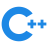
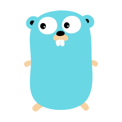
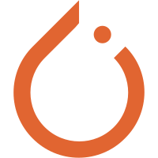
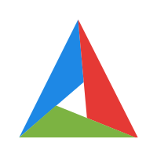
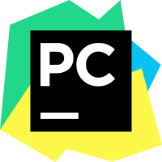

</a>

<!--**
📢你知道什么时候会赢吗？就是往前奔跑。黑夜中你知道什么时候会天亮吗？跑着跑着就天亮了🏃
**-->

 
  
<!--
### 👋 关于我 | Player

- 🌏️ BNU计科专业研三在读生
- 🥉 XCPC铜牌练习生 🔜🧙CV炼丹侠
- 😺 杂食动物：🍦麦旋风, 🎮️打电动, 🎨绘画, 🎸吉他
-->

### 👋 About Me

- 🌏 M.Eng. in CS, Third-year Student @ BNU
- 🥉 XCPC Bronze Medal Trainee → 🧙Computer Vision Alchemist
- 😺 Omnivore like 🍦 McFlurry, 🎮 Gaming, 🎨 Drawing, 🎸 Guitar
- 🔬 Research on Biometric Recognition, Human Pose Estimation, MLLM and 3D Vision
- 🍻 Feel free to reach out if you share similar interests — let’s learn and grow together!

<!--### ⚒️ 技能树 | Stack

| 学习语种                                                     | 开发技能                                                     | 努力修炼                                                     |
| ------------------------------------------------------------ | ------------------------------------------------------------ | ------------------------------------------------------------ |
| <code></code><code></code><code></code><code></code><code></code><code></code> | <code></code><code></code><code></code><code></code><code></code><code></code><code></code> | <code></code><code></code><code></code><code></code> |-->

<!--### 🧰 工具箱 | Tool

<code></code>
<code></code>
<code></code>
<code></code>
<code></code>
<code></code>
<code></code>
<code></code>-->

### 🏆 Data Record

